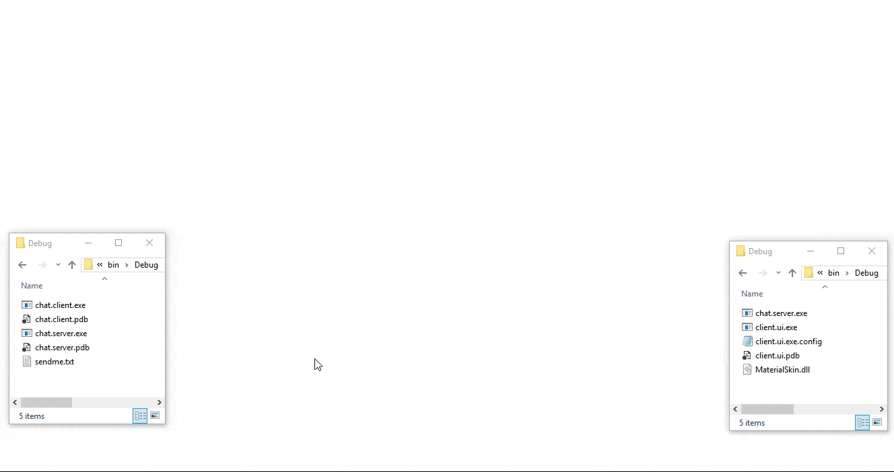

# chat
 Client-Server Chat over TCP Protocol that supports sending files & deadlocks Avoidance. Gui and cli clients.

### References
- [CS327P - Operating Systems-2 course - Dr. Mayada Tarek - Department of Computer science - Faculty of Computers and Information Sciences - Mansoura University](http://csifac.mans.edu.eg/images/files/course-specification/3cs/Operating-Systems-2-.pdf) 
- [SILBERSCHATZ A., GALVIN P.B. and GAGNE G., "OPERATING SYSTEM CONCEPTS ", ninth edition, JOHN WILEY & SONS, INC, 2012.](https://www.os-book.com/OS9/)
